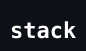
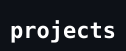

  

Systems Engineering student at UCO, Colombia. I build automation and self-hosted
infrastructure — right now that's a personal setup running three repurposed
laptops as servers over a private mesh network, and
[NanoClaw](https://github.com/jsLopez1104/nanoclaw), a self-hosted AI assistant
I run container-isolated instead of trusting a shared-process framework with
my own data.

[portfolio](https://miportafoliocd.netlify.app) ·
[linkedin](https://linkedin.com/in/juan-sebastian-lopez-valencia-4599b3424) ·
email in profile

python · typescript · javascript · react · c# · n8n · docker · tailscale ·
postgresql · google sheets api

**[NanoClaw](https://github.com/jsLopez1104/nanoclaw)** · docker, node, claude
agent sdk — self-hosted AI assistant, one Docker container per session for
real OS-level isolation instead of a shared process. Picked it over the more
popular alternative specifically for that isolation model.

**[CarDodge](https://github.com/jsLopez1104/CarDodgeUnity)** · unity, python
(flask), mediapipe, firebase — 3D car-dodging game you control by moving your
head in front of a webcam. University research-group project, built from
scratch with two teammates.

**Sistema financiero para transporte de carga** · n8n, google sheets api,
wkhtmltopdf — automated the full financial management of a real freight
company: live dashboards, automatic PDF reports, overdue-payment tracking.
Replaced manual spreadsheets with a system that updates itself.

**Self-hosted infrastructure** · docker, tailscale, ubuntu server, nextcloud —
a private mesh network of repurposed laptops running automation, personal
cloud storage, and an AI assistant, with zero monthly cloud subscriptions.

Every graphic on this page is generated, not embedded from a third-party
service — a scheduled GitHub Action pulls straight from the GitHub GraphQL
API once a day and commits only what changed. Nothing here can rate-limit or
go dark. Typeface is JetBrains Mono, subset per graphic and inlined as
base64, because GitHub strips `<style>`/fonts from the README itself.
